# uefi_ui

A `no_std + alloc` immediate-mode UI library targeting UEFI firmware, with a pixel-perfect
Bedrock-style visual system (3D bevels, teal desktop, navy title bars).

> If you like this thing i made, please visit my [website](https://supernihil.buro.earth) and consider [donating](https://buymeacoffee.com/sloev) some to power me with coffee, thanx :-)

---

## What it is

- **`uefi_ui`** -- widget state, layout, keyboard/mouse abstractions, Bedrock chrome helpers,
  file picker with root-clamping and persistent last-dir, editor settings persisted in UEFI NVRAM.
  Runs on bare UEFI with no operating system underneath. 105 unit tests, runs on host with `cargo test`.
- **`skriver`** -- bootable UEFI text editor. Boots directly to a full-screen editor.
  File picker rooted to user-accessible USB/removable volumes (EFI partitions hidden).
  Settings (font size, theme, last file, last directory) persisted in UEFI NVRAM between boots.
  Build with `make build-skriver`; bootable ISO with `make iso-skriver`.
- **`uefi_ui_test`** (`crates/uefi_ui_demo/`) -- end-to-end test app exercising all widgets
  under UEFI / QEMU. Used by `make qemu`.
- **`uefi_ui_prototype`** -- Linux-hosted simulator for fast visual iteration
  (PNG output, optional SDL2 window).

---

## Build & Run

### Static screenshots (no dependencies)

```sh
cargo run -p uefi_ui_prototype --bin showcase
# Writes docs/screenshots/*.png
```

### Library tests (host, no UEFI required)

```sh
cargo test -p uefi_ui
# 105 tests: widgets, file picker, editor settings, layout, framebuffer
```

### Live SDL2 window (requires `libsdl2-dev`)

```sh
cargo run -p uefi_ui_prototype --features sdl             # widget gallery
cargo run -p uefi_ui_prototype --bin editor --features sdl # text editor
```

### skriver -- bootable text editor

```sh
make build-skriver   # cross-compile for x86_64-unknown-uefi
make iso-skriver     # produce target/skriver.iso (needs mtools, xorriso, dosfstools)
# Boot in QEMU:
qemu-system-x86_64 -machine q35 -m 256M \
  -drive if=pflash,format=raw,readonly=on,file=/usr/share/OVMF/OVMF_CODE_4M.fd \
  -drive file=target/skriver.iso,format=raw,if=none,id=cd \
  -device ide-cd,drive=cd,bus=ide.1
```

### UEFI test app (widget gallery + editor)

```sh
make build-uefi   # cross-compile uefi_ui_test
make qemu         # boots in QEMU with OVMF + FAT ESP
make iso          # bootable ISO at target/uefi_ui_demo.iso
```

---

## Documentation

| Document | Contents |
|----------|---------|
| [Design Manual](designmanual.md) | Visual language, color palette, spacing rules, full widget gallery with screenshots |
| [Theming Guide](THEMING.md) | How to use `Theme`, `BedrockBevel`, and `bedrock_controls` to build or customize the look |

---

## Screenshots

### Widgets

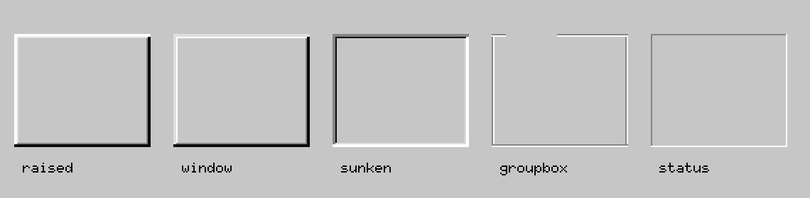
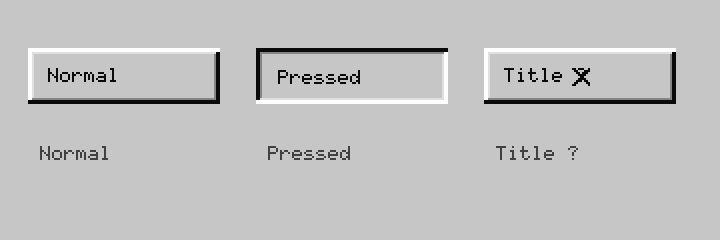
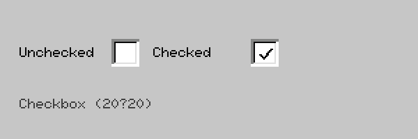
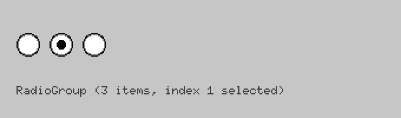
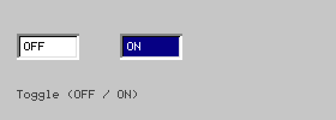
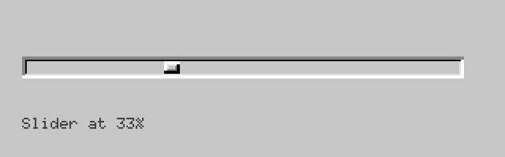
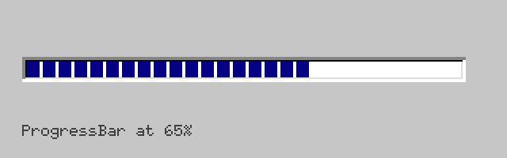
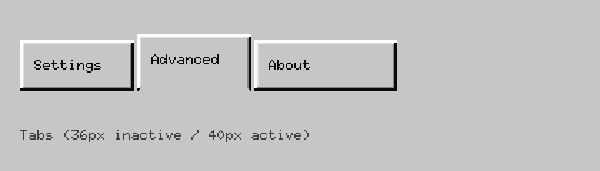
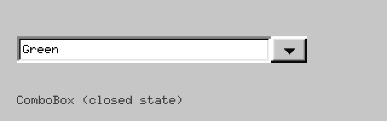
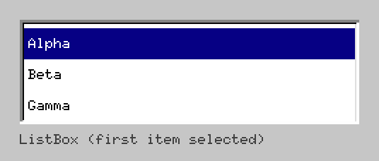
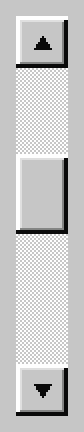
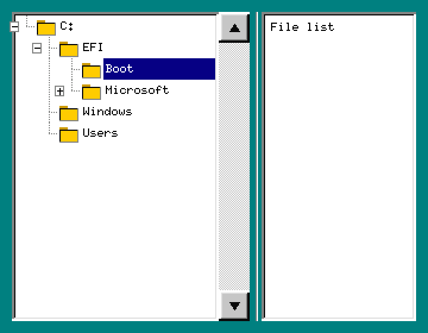
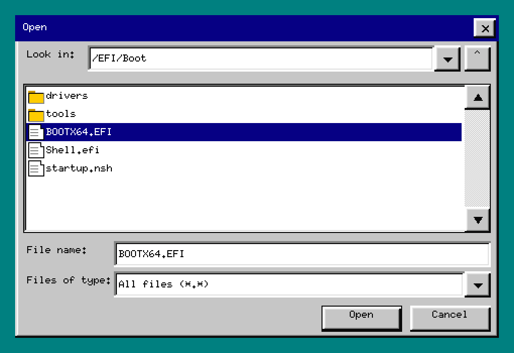

### Editor

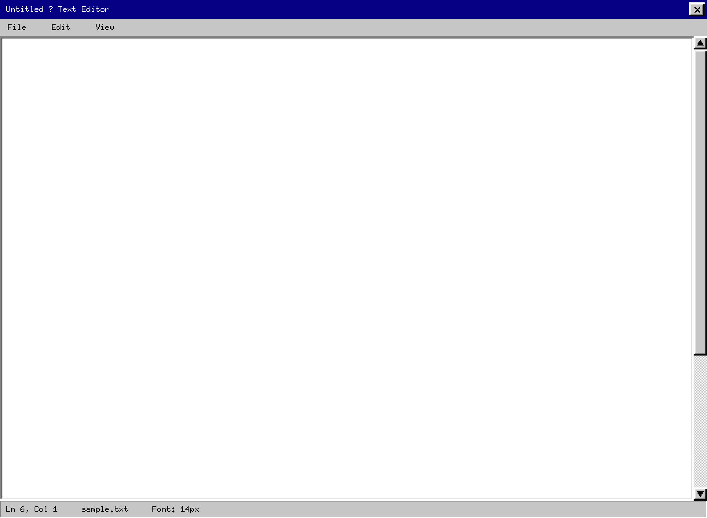
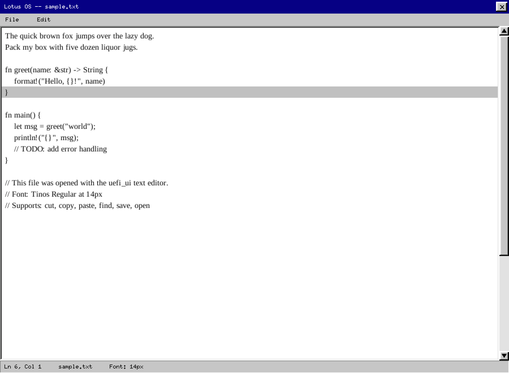
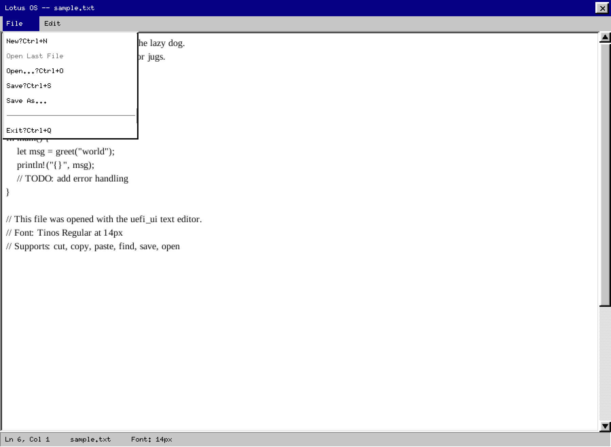
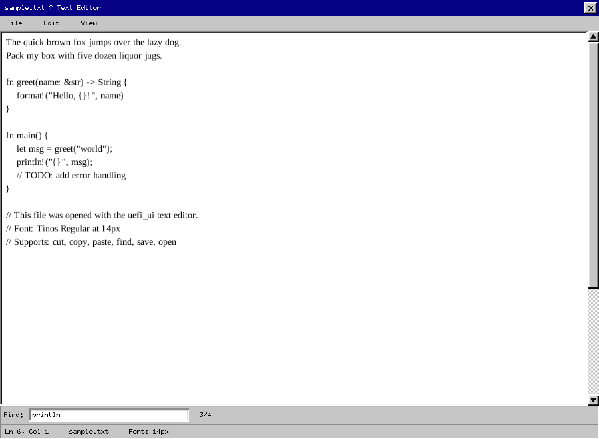
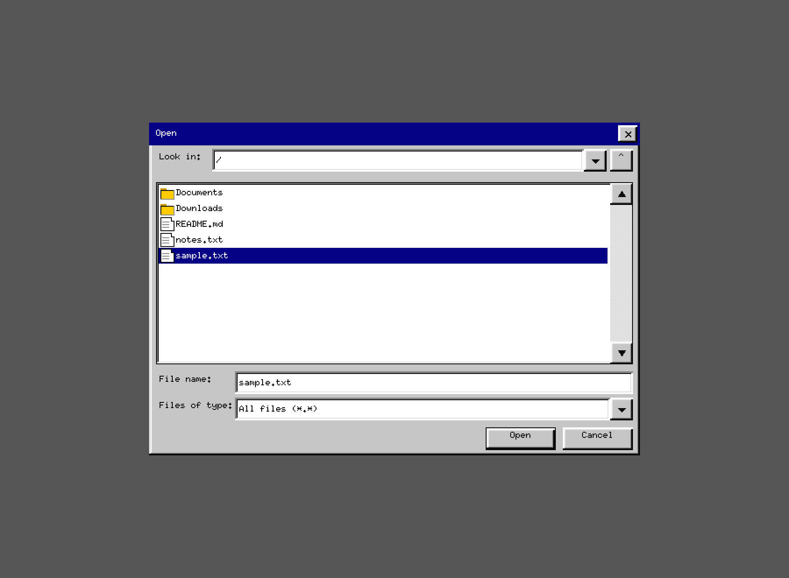
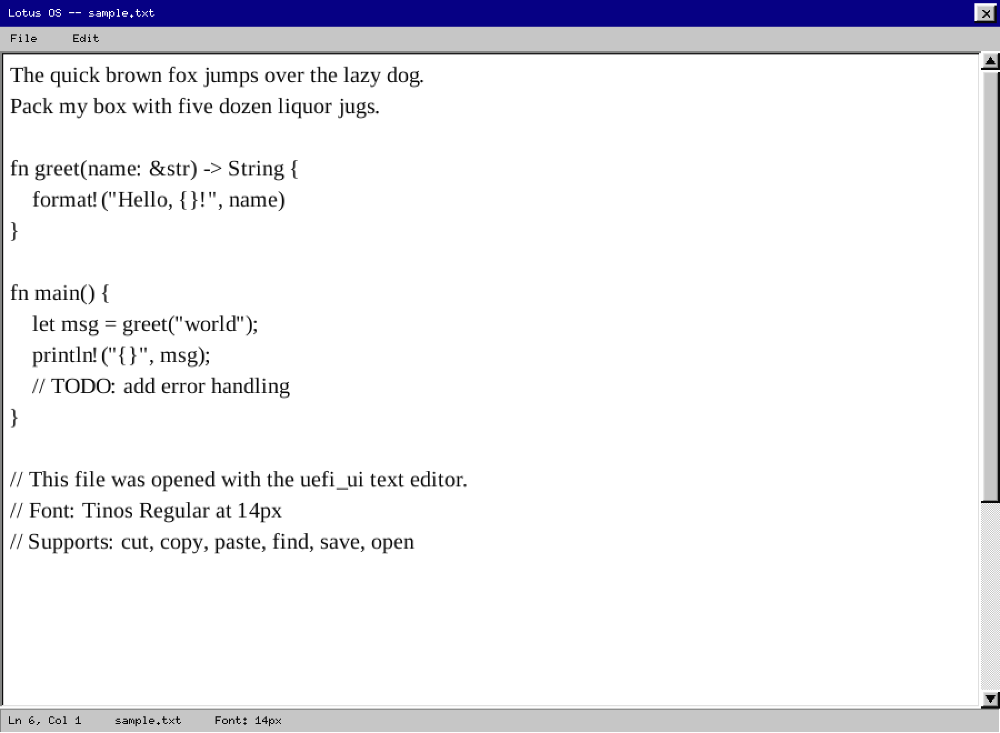

### Decorative

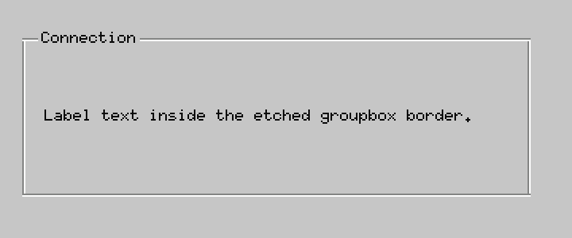
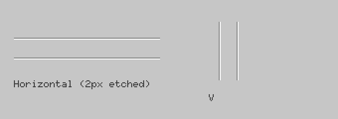
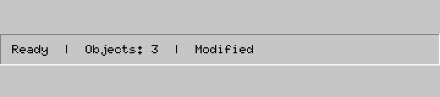
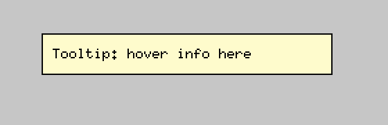
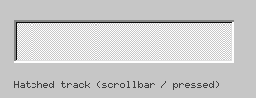
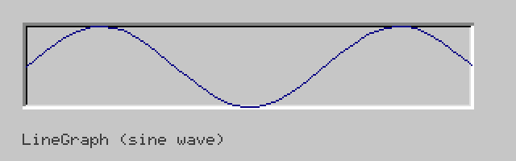
